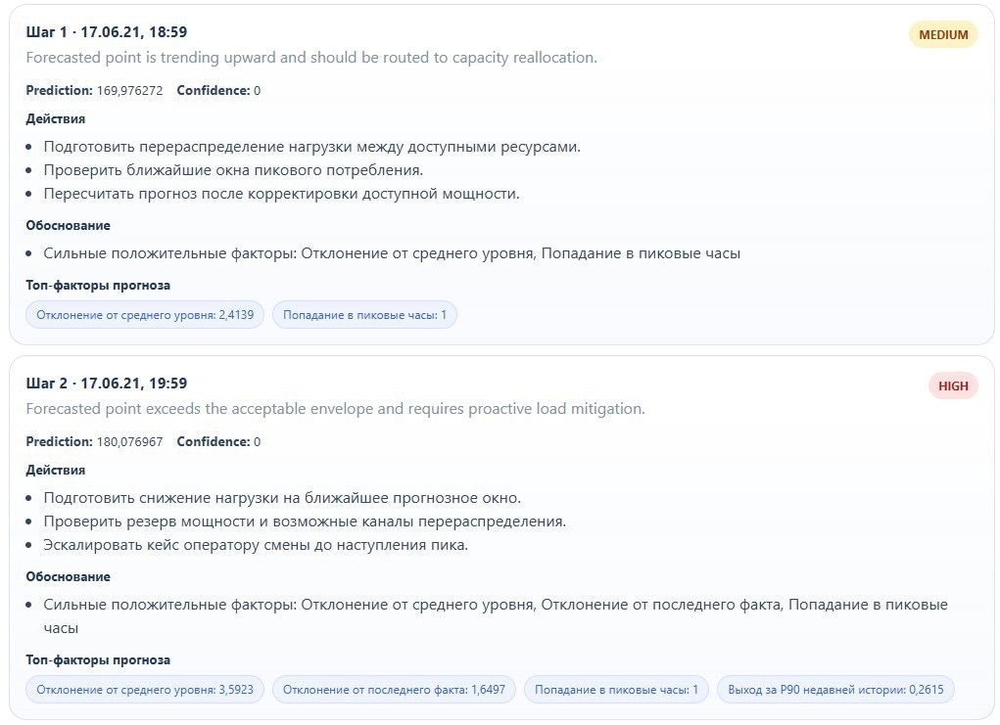

<h1>Платформа автоматизированного машинного обучения и поддержки принятия решений при управлении сложными системами с методом адаптивного переобучения регрессии на новых фактических данных</h1>

<b>AdaptiveML DSS</b> — модульная платформа автоматизированного машинного обучения (AutoML),
прогнозирования, локальной интерпретации и поддержки принятия решений (DSS) для задач регрессии
на табличных данных.

&nbsp;&nbsp;

&nbsp;&nbsp;

<a href="README.md"><b>Русская локализация</b></a>
&nbsp;&nbsp;&nbsp;&nbsp;|&nbsp;&nbsp;&nbsp;&nbsp;
<a href="README_en.md"><b>English Localization</b></a>
&nbsp;&nbsp;&nbsp;&nbsp;|&nbsp;&nbsp;&nbsp;&nbsp;
<a href="README_ch.md"><b>中文本地化</b></a>

<b>А. Э. Дзгоев, Д. С. Колганов, И. В. Корсунов, И. А. Филонов</b> 
<i>МИРЭА – Российский технологический университет</i> 
<i>119454, Россия, Москва, проспект Вернадского, 78</i>

<h2 align="center">Научное сотрудничество</h2>

&emsp;&emsp;Авторы открыты к научному и прикладному сотрудничеству с университетами, исследовательскими
центрами, энергетическими и промышленными предприятиями в области автоматизированного машинного
обучения, прогнозирования, объяснимого искусственного интеллекта и поддержки принятия решений.

&emsp;&emsp;Платформа предназначена как для воспроизводимых исследовательских экспериментов, так и
для создания прикладных систем, в которых обучение модели, контроль ее качества, прогнозирование,
объяснение результата и формирование рекомендации рассматриваются как единый жизненный цикл.

<h2 align="center">Для цитирования</h2>

&emsp;&emsp;Дзгоев А. Э., Колганов Д. С., Корсунов И. В., Филонов И. А. <i>Платформа автоматизированного
машинного обучения и поддержки принятия решений при управлении сложными системами с методом
адаптивного переобучения регрессии на новых фактических данных.</i>

Исходный программный код и материалы проекта доступны в репозитории
<a href="https://github.com/Maronari/AdaptiveML-DSS">AdaptiveML DSS</a>.

<h2 align="center">Аннотация</h2>

&emsp;&emsp;Современные системы автоматизированного машинного обучения для табличных данных позволяют
автоматизировать построение регрессионных моделей, однако их практическая эксплуатация связана
с двумя существенными проблемами. Во-первых, при изменении статистических характеристик признаков
или целевой переменной качество ранее обученной модели может снижаться. Во-вторых, числовой прогноз
не всегда объясняет пользователю причины полученного результата и не определяет дальнейшие действия.

&emsp;&emsp;В настоящей работе представлена <b>AdaptiveML DSS</b> — платформа, объединяющая AutoML на базе
LightAutoML, реестр версий датасетов и моделей, локальную интерпретацию прогнозов с помощью SHAP,
систему поддержки принятия решений на базе Experta и механизм адаптивного переобучения на новых
фактических данных. Платформа принимает данные CSV и Excel, выполняет проверку структуры и качества
входного набора, автоматически обучает регрессионные модели, сохраняет их артефакты и метаданные,
выполняет прогнозирование и предоставляет интерактивную визуализацию результатов.

 
<b>Рис. 1.</b> История версий модели и решений quality gate при адаптивном переобучении.

&emsp;&emsp;Ключевая особенность платформы состоит в последовательности <b>прогноз → SHAP-факторы →
структурированные факты → экспертные правила → рекомендация</b>. Правила задаются в JSON-конфигурации
и могут изменяться без модификации программного кода.

&emsp;&emsp;Экспериментальная часть выполнена на реальных данных электропотребления за 2019–2022 годы.
Для рассматриваемой конфигурации получено R² = 0,9967 на обучающей выборке и R² = 0,9721 на тестовой.
Дополнительно продемонстрировано, что новая версия с ухудшившимся RMSE не заменяет действующую
Champion-модель.

<b>Ключевые слова:</b> автоматизированное машинное обучение, AutoML, табличные данные, SHAP,
система поддержки принятия решений, DSS, LightAutoML, адаптивное переобучение, реестр моделей,
прогнозирование электропотребления, Experta, веб-интерфейс.

<h2 align="center">ВВЕДЕНИЕ</h2>

&emsp;&emsp;Методы машинного обучения широко применяются для прогнозирования и анализа табличных данных
в энергетике, промышленности, финансах и других предметных областях. В исследовательском эксперименте
модель может рассматриваться как законченный результат, однако в реальной эксплуатации после обучения
продолжают поступать новые наблюдения. Поэтому для практической системы важен не только выбор алгоритма,
но и организация жизненного цикла модели.

&emsp;&emsp;Первая проблема связана с data drift и concept drift. Статистические характеристики признаков
X и целевой переменной Y могут изменяться вследствие сезонности, изменения режимов работы оборудования,
экономических условий и других внешних факторов. В результате модель, хорошо описывающая исходную
выборку, со временем может терять точность. Поддержание качества требует регулярного контроля и
переобучения.

&emsp;&emsp;Вторая проблема связана с эффектом «чёрного ящика». Даже точный прогноз не показывает
пользователю, какие факторы сформировали конкретное значение. Для задач управления этого недостаточно:
необходимо связать прогноз с интерпретацией и с формализованным сценарием дальнейших действий.

&emsp;&emsp;Существующие AutoML-фреймворки, включая LightAutoML, AutoGluon и FLAML, автоматизируют
построение моделей, однако в рассматриваемой постановке требуется дополнительный эксплуатационный
слой: управление версиями, контроль адаптивного обновления, локальное объяснение конкретного прогноза
и экспертная поддержка решения.

<h3>Постановка задачи</h3>

&emsp;&emsp;Пусть имеется выборка

$$
D=\{(x_i,y_i)\}_{i=1}^{N},
$$

где $x_i$ — вектор признаков, $y_i$ — фактическое значение целевой переменной, а N — объем выборки.
Требуется построить модель

$$
\hat y_i=f(x_i;\theta),
$$

где θ — параметры выбранного модельного конвейера.

&emsp;&emsp;В отличие от статической задачи, в AdaptiveML DSS состояние данных изменяется. После поступления
новых наблюдений формируется новое состояние $D_t$ и новая версия модели $f_t$. Поэтому качество
рассматривается как функция модели и данных:

$$
Q_t=Q(f_t,D_t).
$$

&emsp;&emsp;Для контроля принятия новой версии используется quality gate. Для регрессионной задачи его
основная логика может быть записана как

$$
RMSE(f_{candidate}) < RMSE(f_{champion}).
$$

&emsp;&emsp;При выполнении условия кандидат может стать Champion. Если условие не выполняется, новая
версия сохраняется в реестре, но действующая модель остается неизменной.

<h2 align="center">1. ОБЗОР СУЩЕСТВУЮЩИХ РЕШЕНИЙ</h2>

&emsp;&emsp;AutoML-системы можно разделить на коммерческие платформы и open-source фреймворки.
К рассматриваемым решениям относятся H2O Driverless AI, DataRobot, Google AutoML Tables,
LightAutoML, AutoGluon и FLAML.

&emsp;&emsp;Коммерческие платформы предоставляют автоматизацию построения моделей и развитые интерфейсы,
а open-source фреймворки позволяют исследователю контролировать программную реализацию. LightAutoML
выбран в качестве основы платформы благодаря поддержке табличного AutoML и автоматизации подготовки
данных и выбора модельного конвейера.

&emsp;&emsp;Однако рассматриваемая задача не заканчивается обучением модели. Необходимо обеспечить
связь модели с конкретной версией данных, сохранить историю переобучения, объяснить отдельный прогноз
и преобразовать результаты интерпретации в формализованную рекомендацию.

<h4>Табл. 1. Сравнение LightAutoML и AdaptiveML DSS / Table 1. Comparison with LightAutoML</h4>

| Критерий | LightAutoML | AdaptiveML DSS |
|---|---|---|
| AutoML для табличных данных | Да | Да |
| Локальное объяснение SHAP | Требует отдельной интеграции | Встроено в контур платформы |
| Переобучение на новых данных | Не является отдельным контуром | Реализован механизм адаптивного переобучения |
| Версионирование моделей | Нет отдельного реестра жизненного цикла | Да |
| Реестр датасетов | Нет отдельного механизма | Да |
| СППР | Нет | Да, Experta |
| Quality gate при обновлении | Нет отдельного механизма | Да |

<h2 align="center">2. АРХИТЕКТУРА ПЛАТФОРМЫ</h2>

 
<b>Рис. 2.</b> Компонентная архитектура платформы AdaptiveML DSS.

&emsp;&emsp;Платформа построена по модульному принципу. Пользователь взаимодействует с веб-интерфейсом,
который обращается к API Gateway на базе FastAPI. Прикладная логика разделена на специализированные
сервисы: `DatasetService`, `TrainingService`, `PredictionService`, `ExplanationService` и `DecisionService`.

&emsp;&emsp;В архитектуре отдельно представлены реестр данных и моделей, файловое хранилище артефактов
и база правил СППР. Это позволяет разделить метаданные жизненного цикла и технические файлы моделей.

<h3>2.1. Загрузка и валидация данных</h3>

&emsp;&emsp;Платформа принимает табличные датасеты в форматах CSV и Excel. При загрузке выполняются
определение типов колонок, проверка пропусков и дубликатов, обработка временных колонок и подготовка
структуры данных для AutoML. Для временных данных могут использоваться календарные характеристики,
включая час, день недели и месяц.

&emsp;&emsp;На этапе прогнозирования дополнительно проверяется совместимость схемы входного набора с
той структурой, на которой была обучена модель. Это позволяет не смешивать ошибку входных данных
с ошибкой математической модели.

<h3>2.2. AutoML-ядро</h3>

&emsp;&emsp;AutoML реализован на базе LightAutoML. Пайплайн выполняет автоматическую предобработку,
подбор алгоритмов и выбор модельного решения по результатам контрольной оценки.

&emsp;&emsp;В набор потенциальных алгоритмов входят:

- **LightGBM** — градиентный бустинг;
- **CatBoost** — градиентный бустинг с поддержкой категориальных признаков;
- **XGBoost** — градиентный бустинг;
- **RandomForest** — ансамбль случайных деревьев;
- **линейные модели**;
- **MLP** — многослойный перцептрон.

&emsp;&emsp;После обучения модель сериализуется и сохраняется вместе с метаданными, необходимыми
для последующего применения и анализа.

<h3>2.3. Реестр моделей</h3>

&emsp;&emsp;Каждая модель получает уникальный идентификатор формата `model-xxxxxxxxxxxx`. Реестр
сохраняет идентификатор, статус, показатели качества и связь с исходным датасетом.

| Статус | Назначение |
|---|---|
| **Champion** | действующая модель, прошедшая критерий качества и используемая для прогнозов |
| **Candidate** | новая модель, находящаяся на этапе оценки |
| **Latest** | последняя обученная версия |
| **Archived** | предыдущая версия, сохраненная для истории |

&emsp;&emsp;`Latest` и `Champion` являются различными состояниями. Последняя обученная версия может
оказаться хуже действующей, поэтому она не должна автоматически становиться рабочей.

<h3>2.4. Реестры и артефакты</h3>

| Объект | Назначение | Содержание |
|---|---|---|
| **D1 Dataset Registry** | управление данными | идентификатор, версия, структура |
| **D2 Model Registry** | управление моделями | ID, статус, метрики, метаданные |
| **D3 Artifact Store** | хранение артефактов | сериализованные модели, препроцессоры |
| **D4 DSS Rule Database** | управление правилами | условия, наборы правил, сценарии |

&emsp;&emsp;Такое разделение позволяет связать вычислительный результат с конкретным состоянием данных,
версией модели и набором правил, использованных для формирования рекомендации.

<h2 align="center">3. СЕРВИСНЫЙ СЛОЙ И ВЗАИМОДЕЙСТВИЕ КОМПОНЕНТОВ</h2>

 
<b>Рис. 3.</b> Последовательность взаимодействия веб-интерфейса, API Gateway и сервисов платформы.

&emsp;&emsp;Сервисная декомпозиция отделяет операции над данными, обучение, прогнозирование,
объяснение и принятие решения. Это уменьшает связанность компонентов и позволяет изменять
отдельный этап без перестройки всей системы.

<h3>3.1. DatasetService</h3>

&emsp;&emsp;`DatasetService` отвечает за загрузку, валидацию и регистрацию наборов данных. При повторной
загрузке может быть создана отдельная версия, сохраняющая историю состояния данных.

<h3>3.2. TrainingService</h3>

&emsp;&emsp;`TrainingService` запускает AutoML-конвейер, получает результат обучения и регистрирует
новую модель. Помимо сериализованной модели сохраняются метаданные и показатели качества.

<h3>3.3. PredictionService</h3>

&emsp;&emsp;`PredictionService` выбирает активную Champion-модель, проверяет входную схему и выполняет
расчет прогнозных значений.

<h3>3.4. ExplanationService</h3>

&emsp;&emsp;`ExplanationService` выполняет локальную интерпретацию отдельного прогноза. SHAP-значения
сортируются по величине вклада, после чего пользователю представляются наиболее значимые факторы.

<h3>3.5. DecisionService</h3>

&emsp;&emsp;`DecisionService` преобразует прогноз и результаты интерпретации в структурированные факты,
передает их в механизм Experta и возвращает выбранный сценарий, рекомендацию, действия и обоснование.

<h2 align="center">4. ВИЗУАЛИЗАЦИЯ И АНАЛИЗ ПРОГНОЗОВ</h2>

&emsp;&emsp;Пользовательский интерфейс предназначен для анализа как агрегированного качества модели,
так и отдельных прогнозных точек. График показывает историю, расчетные значения модели, будущий
прогноз и, если они уже доступны, фактические значения после прогнозного интервала.

 
<b>Рис. 4.</b> Интерактивный интерфейс прогнозирования и анализа ошибок отдельных точек.

&emsp;&emsp;В интерфейсе можно выбирать прогнозный интервал и число отображаемых точек, масштабировать
график и получать точные значения отдельных наблюдений. Для модели выводятся R², RMSE, AIC и BIC,
а таблица обеспечивает доступ к числовым значениям прогноза и ошибки.

<h3>4.1. Критерии качества</h3>

&emsp;&emsp;Для оценки регрессионных моделей используются RMSE, MAE, R², AIC и BIC. RMSE характеризует
масштаб ошибки с повышенной чувствительностью к крупным отклонениям:

$$
RMSE=\sqrt{\frac{1}{n}\sum_{i=1}^{n}(y_i-\hat y_i)^2}.
$$

&emsp;&emsp;MAE определяется как средний модуль отклонения:

$$
MAE=\frac{1}{n}\sum_{i=1}^{n}|y_i-\hat y_i|.
$$

&emsp;&emsp;Коэффициент детерминации определяется выражением

$$
R^2=1-\frac{\sum_i(y_i-\hat y_i)^2}{\sum_i(y_i-\bar y)^2}.
$$

&emsp;&emsp;AIC и BIC используются как информационные критерии при сравнении моделей с учетом
их сложности. В платформе эти показатели доступны вместе с основными метриками качества.

<h3>4.2. Анализ отдельных прогнозных точек</h3>

&emsp;&emsp;Для отдельной точки рассчитываются абсолютная и относительная ошибки:

$$
e_i^{abs}=|y_i-\hat y_i|,
$$

$$
e_i^{rel}=\frac{|y_i-\hat y_i|}{|y_i|}\cdot100\%.
$$

&emsp;&emsp;В интерфейсном примере фактическое значение 166,065 МВт·ч при прогнозе 161,703 МВт·ч
дает абсолютную ошибку 4,362 МВт·ч и относительную ошибку 2,7 %. Такой анализ позволяет
выделять конкретные временные точки, требующие дополнительного исследования.

<h3>4.3. Метаданные зарегистрированной модели</h3>

 
<b>Рис. 5.</b> Метаданные экспериментальной Champion-модели.

&emsp;&emsp;Для модели `model-a36f46663244` зарегистрированы: LightAutoML (LAMA) / TabularAutoML,
фактический компонент ансамбля LightGBM, целевая переменная «Электропотребление», 7 признаков,
датасет `dataset-03afb6540a8f`, 13 867 строк, backend `lightautoml`, preset `tabular`, алгоритмы
`lgb` и `linear_l2`.

&emsp;&emsp;Метаданные позволяют связать результат прогнозирования с конкретной моделью и датасетом,
а не только с названием алгоритма.

<h2 align="center">5. ЛОКАЛЬНАЯ ИНТЕРПРЕТАЦИЯ ПРОГНОЗОВ</h2>

&emsp;&emsp;SHAP (SHapley Additive exPlanations) используется для количественной оценки вклада
признаков в конкретное прогнозное значение. Если глобальная важность характеризует модель
в целом, то локальная интерпретация показывает факторы, сформировавшие отдельный прогноз.

&emsp;&emsp;Для признака j рассматриваются различные подмножества признаков S и изменение значения
функции модели при добавлении j-го признака. Вклад агрегируется по возможным коалициям и
интерпретируется как вклад признака в отклонение прогноза от базового значения.

&emsp;&emsp;В задаче электропотребления среди факторов рассматриваются: превышение 90-го процентиля
исторических значений, отклонение от последнего факта, отклонение от среднего уровня и попадание
в пиковые часы. В интерфейсном примере приведены численные вклады 2,1118; 1,3488; 1,3022 и 1,0.

&emsp;&emsp;Таким образом, объяснение становится количественным объектом, который может быть передан
на следующий этап — в систему поддержки принятия решений.

<h2 align="center">6. СИСТЕМА ПОДДЕРЖКИ ПРИНЯТИЯ РЕШЕНИЙ</h2>

 
<b>Рис. 6.</b> Формирование рекомендации из прогноза, SHAP-факторов и экспертных правил.

&emsp;&emsp;Для каждой прогнозной точки формируется набор структурированных фактов, содержащий
прогнозное значение, уровень риска и выявленные факторы. Экспертные правила Experta сопоставляют
эти факты с условиями и выбирают соответствующий сценарий.

&emsp;&emsp;Сценарий содержит рекомендацию, перечень действий и обоснование. Правила хранятся в
JSON-конфигурации, поэтому пороги и сценарии могут изменяться без изменения программного кода.

<h3>6.1. Детерминированность рекомендаций</h3>

&emsp;&emsp;Детерминированный характер правил позволяет воспроизводить решение и проводить аудит.
Можно установить, какой прогноз был получен, какие факторы были выделены, какие факты сформированы
и какое правило привело к выбранному сценарию.

 
<b>Рис. 7.</b> Пример панели СППР с прогнозом, действиями, обоснованием и топ-факторами.

&emsp;&emsp;В интерфейсном примере для повышенного прогнозного значения формируется рекомендация,
включающая подготовку перераспределения или снижения нагрузки, проверку резервов мощности и
повторный расчет прогноза после корректировки. В качестве оснований используются отклонение
от среднего уровня, отклонение от последнего факта и попадание в пиковые часы.

&emsp;&emsp;Рекомендация не заменяет решение специалиста. Она является воспроизводимым результатом
формализованного набора условий, а окончательное управленческое действие остается за ЛПР.

<h2 align="center">7. АДАПТИВНОЕ ПЕРЕОБУЧЕНИЕ И QUALITY GATE</h2>

&emsp;&emsp;Адаптивное переобучение предназначено для ситуации, когда после первоначального обучения
поступают новые размеченные фактические данные. На их основе создается новая версия модели,
которая регистрируется независимо от действующей.

&emsp;&emsp;Контроль качества отделяет обучение от активации. Новая модель сначала получает статус
Candidate или Latest, затем ее показатели сравниваются с Champion. Если качество ухудшилось,
действующая модель сохраняется.

 
<b>Рис. 8.</b> Динамика RMSE четырех последовательных версий модели.

&emsp;&emsp;В проекте `energy` зафиксирована следующая последовательность версий:

| Версия | Статус | RMSE | Изменение |
|---|---|---:|---:|
| `model-cf9eb8376072` | Archived | 3,1248 | исходная модель |
| `model-3e4cc357efc5` | Candidate | 2,7803 | улучшение 0,3445 (11,0 %) |
| `model-a36f46663244` | Champion | 2,7106 | улучшение 0,0697 (2,5 %) |
| `model-1d6878955cb0` | Latest | 2,9485 | ухудшение 0,2379 (8,8 %) |

&emsp;&emsp;От исходной версии к Champion RMSE снизился с 3,1248 до 2,7106, то есть на 13,2 %.
Последняя обученная версия имеет RMSE 2,9485 и поэтому не заменяет Champion. Это демонстрирует
назначение quality gate как механизма защиты рабочей модели от неконтролируемого ухудшения.

<h2 align="center">8. ЭКСПЕРИМЕНТАЛЬНАЯ ОЦЕНКА</h2>

<h3>8.1. Реальные данные</h3>

&emsp;&emsp;Работоспособность платформы проверена на реальных данных электропотребления за период
2019–2022 годов. В качестве источника указаны данные ПАО «Россети Северный Кавказ»
(АО «Севкавказэнерго»).

&emsp;&emsp;Для экспериментальной Champion-модели использован датасет `dataset-03afb6540a8f`,
содержащий 13 867 строк и 7 признаков. Целевая переменная — «Электропотребление».

<h3>8.2. Основные результаты</h3>

| Выборка | R² |
|---|---:|
| Обучающая | **0,9967** |
| Тестовая | **0,9721** |

&emsp;&emsp;Полученные значения показывают высокую долю объясненной вариации целевой переменной
на рассматриваемых выборках. Показатели относятся к конкретной конфигурации эксперимента
и не должны интерпретироваться как универсальная оценка для других наборов данных.

<h3>8.3. Горизонты прогнозирования</h3>

&emsp;&emsp;Экспериментальный контур рассматривает горизонты **24, 72 и 168 часов**. Для оценки
используются MAE, RMSE, MAPE и R². Такое сравнение позволяет анализировать изменение качества
при увеличении горизонта прогнозирования.

<h3>8.4. Показатели интерфейсного эксперимента</h3>

&emsp;&emsp;Для зарегистрированной Champion-модели интерфейс показывает r = 0,998001, MSE = 7,34724,
RMSE = 2,710579, MAE = 1,992117, R² = 0,995975, AIC = 5548,256789, BIC = 5595,681154 и
AICc = 5548,308869. Для блока forecasting отображаются r = 0,9967, R² = 0,9933, MSE = 10,215,
RMSE = 3,1961, AIC = 6507,1277, AICc = 6508,4452 и BIC = 6755,954.

&emsp;&emsp;Эти показатели иллюстрируют различие между качеством модели на исторических данных
и качеством непосредственно прогнозного интервала.

<h2 align="center">9. ВОСПРОИЗВОДИМОСТЬ И ТРАССИРУЕМОСТЬ</h2>

&emsp;&emsp;Воспроизводимый результат требует сохранить не только модель, но и контекст ее получения.
В AdaptiveML DSS этот контекст включает идентификатор датасета, идентификатор модели, статус,
целевую переменную, число признаков, алгоритмические компоненты и показатели качества.

&emsp;&emsp;При переобучении создается новый идентификатор, а предыдущая версия остается в истории.
Это позволяет сравнивать качество моделей независимо от ручных журналов и связывать прогноз
с конкретным состоянием данных.

<h2 align="center">10. WEB-ИНТЕРФЕЙС И РАЗВЕРТЫВАНИЕ</h2>

&emsp;&emsp;Веб-интерфейс реализован с использованием HTML/CSS/JavaScript и Chart.js. Через него
доступны загрузка датасетов, запуск обучения, просмотр истории моделей, прогнозирование,
анализ ошибок и получение рекомендаций СППР.

&emsp;&emsp;Взаимодействие клиентской части с сервером осуществляется через REST API на базе FastAPI.
Бэкенд и фронтенд предусматриваются к развертыванию в Docker-контейнерах. SQLite используется
как легковесное хранилище реестров и метаданных.

<h2 align="center">11. ПРИКЛАДНОЕ ЗНАЧЕНИЕ</h2>

&emsp;&emsp;Платформа может применяться для:

- прогнозирования электропотребления и других количественных показателей;
- анализа табличных данных;
- промышленных прогнозных систем;
- мониторинга качества моделей;
- локальной интерпретации отдельных прогнозов;
- поддержки принятия решений по формализованным экспертным правилам;
- исследовательских задач с воспроизводимым управлением версиями моделей.

&emsp;&emsp;Архитектура позволяет использовать одну и ту же версию модели на этапах прогнозирования,
объяснения и формирования рекомендации, что уменьшает риск рассогласования результатов.

<h2 align="center">12. ОБСУЖДЕНИЕ РЕЗУЛЬТАТОВ</h2>

&emsp;&emsp;Разработанная система рассматривает AutoML как часть полного жизненного цикла модели.
На этапе обучения формируется кандидат, реестр обеспечивает его идентификацию и историю,
PredictionService применяет модель, SHAP объясняет конкретный результат, а DecisionService
преобразует объяснение в формализованный сценарий.

&emsp;&emsp;Наиболее существенным является разделение `Latest` и `Champion`. Это позволяет продолжать
процесс обучения при поступлении новых данных, одновременно сохраняя проверенную рабочую версию
при ухудшении качества нового кандидата.

&emsp;&emsp;Связка SHAP и Experta дополнительно уменьшает разрыв между числовым прогнозом и управленческой
интерпретацией. Результаты объяснения не просто отображаются пользователю, а становятся частью
структурированного набора фактов, на котором работают экспертные правила.

<h2 align="center">13. ЗАКЛЮЧЕНИЕ</h2>

&emsp;&emsp;Представлена модульная платформа AdaptiveML DSS, объединяющая автоматизированное обучение
регрессионных моделей на базе LightAutoML, реестр датасетов и моделей, прогнозирование, локальную
интерпретацию SHAP и систему поддержки принятия решений на базе Experta.

&emsp;&emsp;Ключевой механизм разработки — адаптивное переобучение с контролем качества. Новая версия
может быть обучена на новых фактических данных, но ее активация зависит от сравнения с действующей
Champion-моделью. Экспериментальная история показала, что ухудшившаяся Latest не заменяет Champion.

&emsp;&emsp;На реальных данных электропотребления за 2019–2022 годы получены R² = 0,9967 на обучающей
и R² = 0,9721 на тестовой выборке. Для экспериментальной Champion-модели зарегистрированы 7
признаков, 13 867 строк обучающего датасета и фактический компонент ансамбля LightGBM.

<h2 align="center">14. НАПРАВЛЕНИЯ ДАЛЬНЕЙШЕГО РАЗВИТИЯ</h2>

1. обработка датасетов объемом более 1 млн строк с использованием **Dask** и **Apache Spark**;
2. автоматическое обнаружение **data drift / concept drift** с использованием **Evidently**;
3. визуальный редактор экспертных правил с интерфейсом **drag-and-drop**;
4. прогнозные интервалы на основе квантилей **P10/P90**;
5. интеграция с **MLflow** и **Kubeflow** для MLOps-сценариев.

<h2 align="center">СПИСОК ЛИТЕРАТУРЫ</h2>

1. Кустицкая Т. А., Есин Р. В., Кытманов А. А., Зыкова Т. В. Мониторинг дрейфа данных и концепта в промышленных системах машинного обучения: метрики, quality gates и мониторинг дрейфа // Молодой учёный. 2026. № 3(613). URL: https://moluch.ru/archive/613/134123 (дата обращения: 15.08.2026).
2. Соболевский В. А. Автоматизация создания моделей машинного обучения для решения задач прогнозирования временных рядов // Известия вузов. Приборостроение. 2024. Т. 67. № 11. С. 951–957. DOI: 10.17586/0021-3454-2024-67-11-951-957.
3. Кумаритов А. М., Дзгоев А. Э., Бабочиев О. Р., Хузмиев И. М. Моделирование системы контроля затрат для поддержки принятия решений при управлении электросетевым предприятием // Проблемы энергетики. 2015. № 9–10. С. 35–43.
4. Бирюков Д. Н., Супрун А. Ф. От «черного ящика» к прозрачности: философско-методологические основы объяснимости и интерпретируемости в искусственном интеллекте // Проблемы информационной безопасности. Компьютерные системы. 2025. № 1. С. 30–42. DOI: 10.48612/jisp/x8ve-86ez-fv94.
5. Агеев В. А., Казаков Д. В., Репьев Д. С. Обзор традиционных и нейросетевых методов прогнозирования электрической нагрузки // Огарёв-online. 2023.
6. AdaptiveML DSS. GitHub repository. URL: https://github.com/Maronari/AdaptiveML-DSS
7. H2O.ai. H2O Driverless AI — Automated Machine Learning. URL: https://www.h2o.ai/products/h2o-driverless-ai/
8. DataRobot. Enterprise AI Platform — Automated Machine Learning. URL: https://www.datarobot.com/ (дата обращения: 15.08.2026).
9. Google Cloud. AutoML Tables — Automated Machine Learning for Tabular Data. URL: https://cloud.google.com/automl-tables (дата обращения: 15.08.2026).
10. LightAutoML. GitHub repository. URL: https://github.com/sberbank-ai/LightAutoML (дата обращения: 15.08.2026). Документация: https://lightautoml.readthedocs.io/
11. AutoGluon. AutoML for Tabular, Text, Image, and Time Series Data. URL: https://auto.gluon.ai/ (дата обращения: 15.08.2026). GitHub: https://github.com/autogluon/autogluon
12. FLAML. A Fast and Lightweight AutoML Library. URL: https://microsoft.github.io/FLAML/ (дата обращения: 15.08.2026). GitHub: https://github.com/microsoft/FLAML
13. Алкацев М. И., Дзгоев А. Э., Бетрозов М. С. Исследование и разработка метода прогнозирования потребления электроэнергии в системе управления электроснабжением региона // Известия высших учебных заведений. Проблемы энергетики. 2012. № 5–6.
14. Хуснутдинов А. О., Хабаров В. И., Карманов В. С. Глубокое обучение для анализа многомерных временных рядов: систематизация типов данных, задач, архитектур и подходов // Системы анализа и обработки данных. 2025. № 3 (99). С. 113–136. DOI: 10.17212/2782-2001-2025-3-113-136.
15. Аботалеб М. С. А. Алгоритмы прогнозирования временных рядов на основе взвешенного метода наименьших модулей: дис. канд. физ.-мат. наук. Челябинск, 2024. 182 с.
16. Воробьев А. В. Метод выбора модели машинного обучения на основе устойчивости предикторов с применением значения Шепли // Экономика. Информатика. 2021. Т. 48, № 2. С. 350–359. DOI: 10.52575/2687-0932-2021-48-2-350-359.
17. Дедевшин А. С., Клячкин В. Н. Влияние объёма выборки на качество регрессий при различных методах машинного обучения // Вестник Ульяновского государственного технического университета. 2024. № 2 (106).

<h2 align="center">ДОПОЛНИТЕЛЬНАЯ ИНФОРМАЦИЯ</h2>

<h3>Конфликт интересов</h3>

&emsp;&emsp;Авторы заявляют об отсутствии конфликта интересов.

<h3>Вклад авторов</h3>

&emsp;&emsp;Авторами разработки являются А. Э. Дзгоев, Д. С. Колганов, И. В. Корсунов и И. А. Филонов.

<h3>Финансирование</h3>

&emsp;&emsp;Сведения о финансировании в исходном материале не приведены.

<h3>Информация об авторах</h3>

- **Дзгоев Алан Эдуардович** — к.т.н., доцент кафедры цифровой трансформации Института информационных технологий РТУ МИРЭА. E-mail: `Dzgoev@mirea.ru`.
- **Колганов Дмитрий Сергеевич** — магистр по направлению «Информатика и вычислительная техника» кафедры вычислительной техники Института информационных технологий РТУ МИРЭА. E-mail: `dkolganov2000@gmail.com`.
- **Корсунов Иван Валдимирович** — магистр по направлению «Информатика и вычислительная техника» кафедры вычислительной техники Института информационных технологий РТУ МИРЭА. E-mail: `ivan.corsunov@gmail.com`.
- **Филонов Иван Александрович** — магистр по направлению «Информатика и вычислительная техника» кафедры вычислительной техники Института информационных технологий РТУ МИРЭА. E-mail: `dec200211@gmail.com`.

<h2 align="center">ЛИЦЕНЗИЯ</h2>

&emsp;&emsp;Проект распространяется на условиях **Apache License 2.0**.
