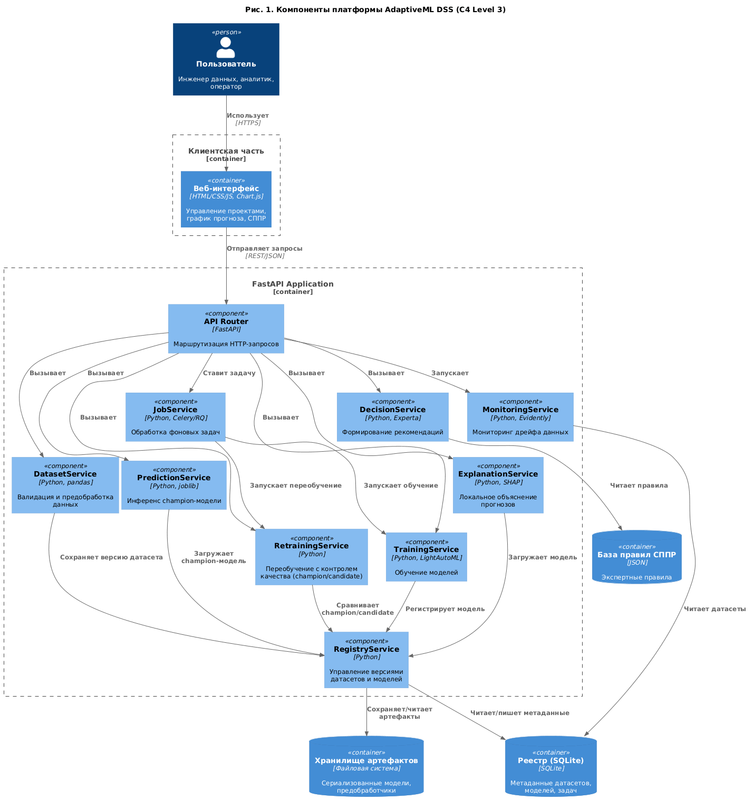
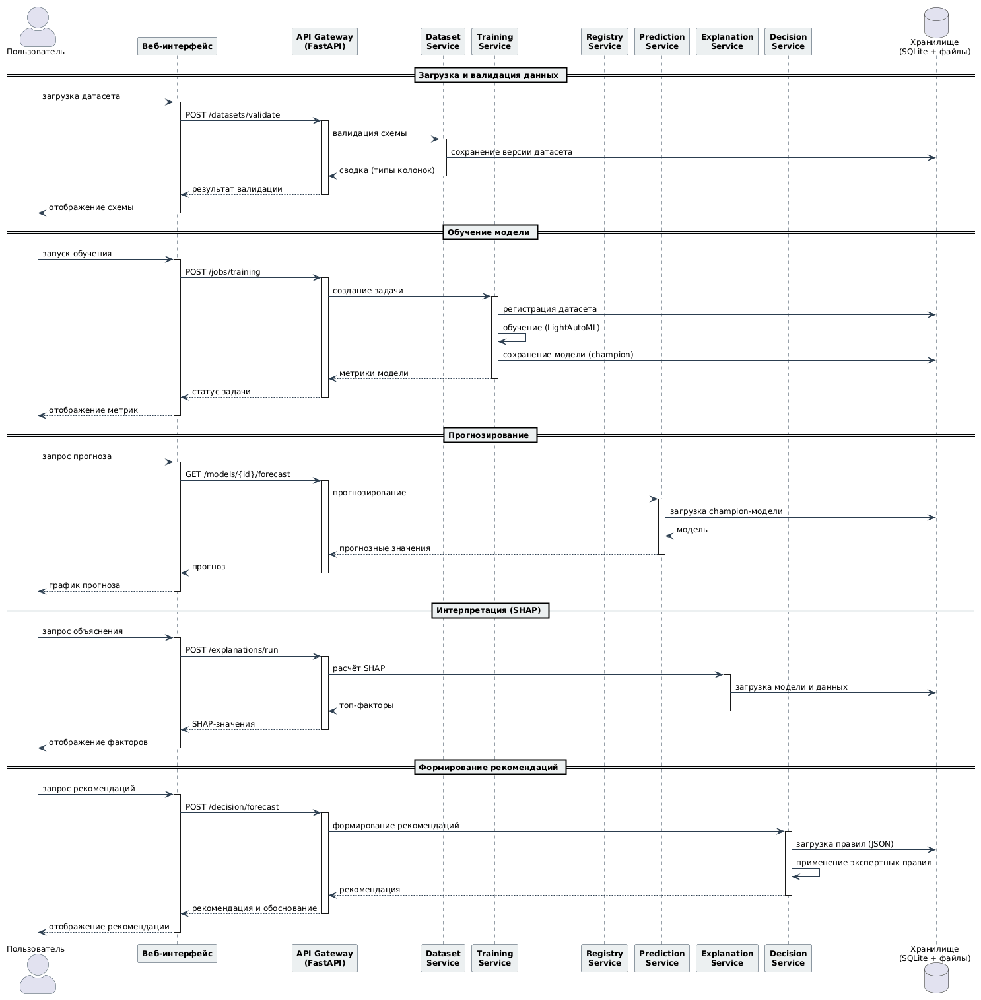
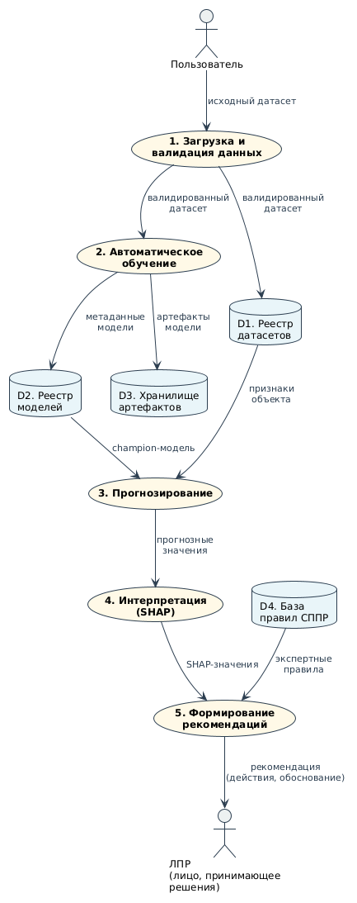
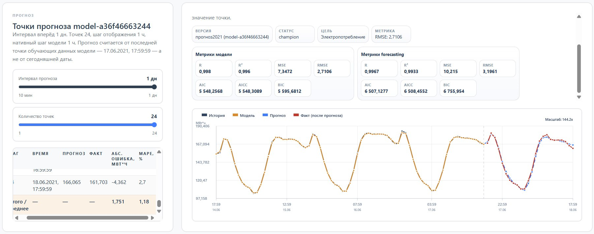
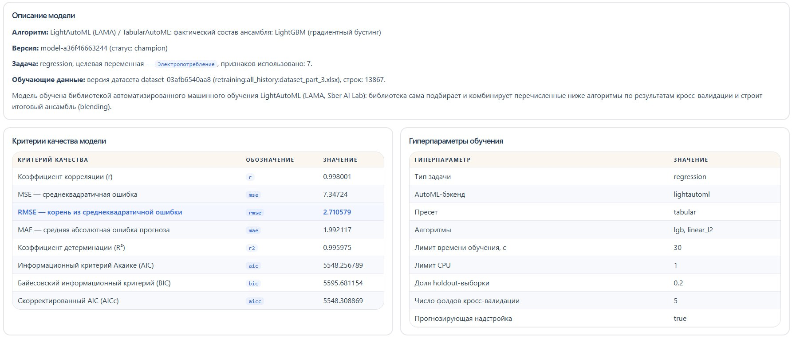
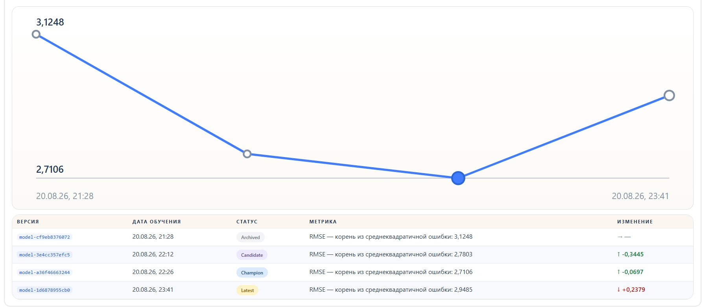

<h1>
面向复杂系统管理的自动化机器学习与决策支持平台，
采用基于新实际数据的回归自适应再训练方法
</h1>

<b>AdaptiveML DSS</b> — 一个模块化的自动化机器学习（AutoML）
与决策支持系统（DSS）平台，用于回归和表格数据预测任务。
该平台结合了基于 LightAutoML 的自动训练、使用 SHAP 的预测局部解释、
数据集与模型版本注册表、Experta 专家规则，以及基于新标注数据的
自适应再训练机制。

   

<a href="README.md"><b>俄语版本</b></a>   \|  
<a href="README_en.md"><b>英语版本</b></a>   \|  
<a href="README_ch.md"><b>中文版本</b></a>

<b>A. E. 兹戈耶夫，D. S. 科尔加诺夫，I. V. 科尔苏诺夫，I. A.
菲洛诺夫</b>   <i>MIREA — 俄罗斯技术大学</i>  
<i>119454，俄罗斯，莫斯科，韦尔纳茨基大道，
78 号</i>

<h2 align="center" style="border-bottom: none; border: none;">
引用格式
</h2>

&emsp;&emsp;Dzgoev A. E., Kolganov D. S., Korsunov I. V., Filonov I. A.
<i>面向复杂系统管理的自动化机器学习与决策支持平台，
采用基于新实际数据的回归自适应再训练方法。</i>

<h2 align="center" style="border-bottom: none; border: none;">
摘要
</h2>

&emsp;&emsp;面向表格数据的现代自动化机器学习（AutoML）系统尽管发展迅速，
但仍存在若干局限：缺乏在新数据上自动再训练模型的内置机制，
缺少预测局部解释和决策支持工具。因此，现有的开源解决方案可能无法
充分适应变化的数据，用户获得的预测结果缺乏对其形成原因的解释。

&emsp;&emsp;为评估该领域的现状，本文对国内外 AutoML 框架进行了综述，
特别是 LightAutoML、AutoGluon 和 FLAML。在此基础上开发了
AdaptiveML DSS 平台，将 AutoML、通过 SHAP 方法进行的预测局部解释，
以及根据一组专家规则解释预测的决策支持系统相结合。
其关键特性是自适应再训练机制，允许在新标注数据到达时更新模型
并进行质量控制。

&emsp;&emsp;实验部分在 2019–2022 年真实电力消耗数据上完成。
使用 R²、RMSE、MAE、AIC 和 BIC 评估质量。在训练集上获得
R² = 0.9967，在测试集上获得 R² = 0.9721。决策支持系统生成建议，
解释哪些特征影响了预测以及它们与所选场景的关系。

<b>关键词：</b>自动化机器学习，表格数据，SHAP，决策支持系统，
LightAutoML，自适应再训练，模型注册表，电力消耗预测，Experta，
Web 界面。

<h2 align="center" style="border-bottom: none; border: none;">
引言
</h2>

&emsp;&emsp;现代机器学习方法广泛用于能源、工业和金融领域中的表格数据预测和
分类任务。然而，机器学习模型的实际运行涉及两个重要问题。

&emsp;&emsp;第一个问题与数据漂移（concept drift / data drift）现象有关 [1]。
特征 X 或目标变量 Y 的统计特征可能因季节性、设备运行模式变化和经济条件而
改变。结果，在特定样本上训练的模型会随时间失去准确性。保持预测质量需要
定期再训练数学模型，而在大多数现有 AutoML 解决方案中，这是手动执行的 [2]。
对于能源行业，降低预测误差具有直接的实际意义，因为它影响电力系统运行模式的
经济性。

&emsp;&emsp;采集和处理用电数据的经济方面也很重要。自动抄表和控制系统（AMR）中
数据传输的成本取决于被轮询计量设备的类别；"小电机"部门的计量点对财务成本
有显著影响 [3]。因此，综合方法是可取的，将预测与决策支持相结合，
不仅考虑预测质量，还考虑相关的运营成本。

&emsp;&emsp;第二个问题是现代模型的不可解释性 [4]，通常称为"黑箱"效应。
即使预测精度很高，用户也无法理解哪些特征以及如何影响了结果。缺乏透明度
降低了对 AutoML 系统的信任，并阻碍了基于其输出的明智决策。

&emsp;&emsp;现有的开源 AutoML 框架，特别是 LightAutoML，提供了算法和超参数的
自动选择，但不包含在新数据上再训练的内置机制，不维护模型版本注册表，
也不包含解释预测的内置工具 [5]。

&emsp;&emsp;本文介绍了 AdaptiveML DSS 平台 [6]，旨在消除这些局限。该平台实现了
CSV 和 Excel 格式表格数据集的加载和验证；基于 LightAutoML 的模型自动训练，
并将数据集和模型版本保存在注册表中；在新数据上进行预测并检查模式兼容性；
使用 SHAP 对预测进行局部解释；基于 Experta 专家规则生成建议；
具有缩放和预测区间选择的图形可视化；在新标注数据到达时再训练模型。

&emsp;&emsp;该平台的关键特性是 DSS，它将预测和识别出的关键影响特征转换为
结构化的事实集合，然后基于 Experta 的专家规则形成最终建议。
规则可以通过 JSON 配置进行编辑，而无需更改程序代码，从而确保适应
各种主题领域。

&emsp;&emsp;该架构按模块化原则构建，包括 FastAPI 后端、服务层
DatasetService、TrainingService、PredictionService、ExplanationService 和
DecisionService，以及将元数据存储在 SQLite 中的数据集和模型注册表，
还有用于管理项目、启动训练、查看模型版本历史和可视化预测的 Web 界面。

<h2 align="center" style="border-bottom: none; border: none;">
1. 现有解决方案综述
</h2>

&emsp;&emsp;用于回归数据的自动化机器学习系统可分为商业平台和开源框架。

&emsp;&emsp;商业解决方案包括 H2O Driverless AI [7]、DataRobot [8] 和
Google AutoML Tables [9]。它们提供模型和超参数的自动选择，拥有完善的
用户界面，并支持全局特征重要性层面的基本可解释性。同时，它们也存在
闭源、缺乏新数据到达时自动再训练机制、模型版本管理能力有限以及需要
许可费用等问题，这对科学和教育项目尤为重要。

&emsp;&emsp;在开源解决方案中，LightAutoML [10]、AutoGluon [11] 和 FLAML [12]
较为突出。由俄罗斯联邦储蓄银行（Sberbank of Russia）开发的 LightAutoML
是一个轻量级的表格数据自动训练框架，支持梯度提升、随机森林、线性模型和
神经网络，以及自动预处理。Amazon 的 AutoGluon 和 Microsoft 的 FLAML
提供类似的基本功能。然而，这些解决方案不提供在新数据上再训练的内置机制、
数据集和模型版本注册表以及默认情况下对每个预测的局部可解释性；
此类功能需要额外集成 [13]。

&emsp;&emsp;与此同时，在电力消耗预测领域，数据处理方法正在发展，允许通过
删除过时数据并添加新的实际观测来持续更新回归模型系数。由于电力消耗是
一个复杂的多维时间序列，考虑时间依赖性和噪声数据结构特征的神经网络架构的
系统化变得越来越重要 [14]。所述方法指出预测误差降低到 4–6 %，
供电管理质量得到提高 [15]。

#### 表 1. LightAutoML 与 AdaptiveML DSS 的比较

| 标准 | LightAutoML | AdaptiveML DSS |
|---|---|---|
| AutoML（表格数据） | 是 | 是 |
| 局部解释（SHAP） | 否（需手动连接） | 是 |
| 在新数据上再训练 | 否 | 是（按用户请求） |
| 模型版本管理 | 否 | 是 |
| 数据集注册表 | 否 | 是 |
| 决策支持系统 | 否 | 是（Experta） |

&emsp;&emsp;因此，现有的开源解决方案提供了基本的 AutoML 功能，但没有提供
用于保持模型随时间相关性、管理版本和局部解释结果的集成工具。
AdaptiveML DSS 将 AutoML、评估每个特征贡献的局部可解释性、版本注册表
以及基于专家规则的决策支持系统相结合。

<h2 align="center" style="border-bottom: none; border: none;">
2. 平台架构
</h2>

&emsp;&emsp;AdaptiveML DSS 平台按模块化原则构建，包括数据加载和验证模块、
AutoML 核心、模型注册表、预测和解释服务，以及决策支持系统。
组件的整体架构如图 1 所示。

<b>图 1.</b> AdaptiveML DSS 平台组件（C4
Level 3）

&emsp;&emsp;加载和验证模块接受 CSV 和 Excel。系统自动确定列类型——数值型、
类别型和日期/时间型——检查缺失值和重复值，并在预测时控制输入数据模式的
兼容性。从时间列中提取小时、星期几和月份特征。

&emsp;&emsp;AutoML 核心基于 LightAutoML 实现。它执行自动预处理，包括填充
缺失值和编码类别变量，遍历算法 LightGBM、CatBoost、XGBoost、RandomForest、
线性模型和神经网络（包括多层感知机 MLP），然后在留出集（hold-out）上
选择最佳管道。训练后的模型被序列化并与元信息一起保存。

&emsp;&emsp;模型注册表存储数据集和模型版本。每个模型被分配唯一标识符、
版本和状态：<b>Candidate</b>、<b>Champion</b>、
<b>Latest</b> 或 <b>Archived</b>。
模型工件——序列化的模型和预处理器——与元信息一起保存。

| 状态 | 用途 |
|---|---|
| **Champion** | 按主要质量指标（回归的 RMSE）被认定为最佳并默认用于预测的模型 |
| **Candidate** | 在新数据上训练但未超过 Champion 的候选模型 |
| **Latest** | 最新训练的版本 |
| **Archived** | 已过时的模型，保存以便能够返回，例如用于再训练 |

&emsp;&emsp;这种状态系统确保了再训练的透明度，并允许用户返回以前的版本。
预测和解释服务加载活动的 Champion 模型，检查输入数据的兼容性并执行预测。
对于局部解释，使用 SHAP 值；向用户呈现 3–5 个最显著的因素及其数值影响。

&emsp;&emsp;DSS 将预测和 SHAP 因素转换为结构化的事实集合，然后 Experta
形成最终建议。规则通过 JSON 配置编辑，无需更改代码。提供了在新实际数据
到达时每日再训练候选模型的可能性，允许适应变化的条件而无需从头完全再训练。

&emsp;&emsp;处理用户请求时组件交互的场景如图 2 所示。

<b>图 2.</b> UML 序列图：
用户请求处理场景

&emsp;&emsp;该图反映了 Web 界面、API Gateway 和服务层之间的调用顺序，
以及模型指标、预测值、SHAP 因素和最终建议的返回。

&emsp;&emsp;进程和存储之间的数据流如图 3 所示。外部实体是用户和决策者（DM）。
主要流程包括数据加载和验证、自动训练、预测、SHAP 解释和建议生成。
数据存储：D1 — 数据集注册表，D2 — 模型注册表，D3 — 工件存储，
D4 — DSS 规则库。

<b>图 3.</b> AdaptiveML DSS 平台的数据流图（DFD）

&emsp;&emsp;Web 界面是使用 Chart.js 的 HTML/CSS/JS 单页应用。用户可以加载数据集、
启动训练、查看模型版本历史、使用可缩放和选择周期的交互式预测图，
以及显示建议。所有组件通过基于 FastAPI 的 REST API 集成。
后端和前端使用 Docker 容器化。

<h2 align="center" style="border-bottom: none; border: none;">
3. 预测的可视化与解释
</h2>

&emsp;&emsp;该平台提供两个主要的预测操作界面：图形化预测显示页面和决策支持
系统页面。两个界面使用相同的模型版本，确保显示数据的一致性。

&emsp;&emsp;在可视化页面上，可以使用指定未来时间区间的交互式预测图。
可以选择预测周期，例如 1 到 24 小时或 1 天，并调整显示点的数量。
图表支持鼠标滚轮缩放和拖动平移。悬停光标时显示精确的预测值。
对于模型版本，输出 R²、RMSE、AIC 和 BIC。预测还以表格形式呈现，
包含时间戳和每个步骤的数值。

<b>图 4.</b> 模型 <code>model-a36f46663244</code>
（Champion）的预测图

&emsp;&emsp;图 4 中的预测区间为 1 天：24 个点，步长为 1 小时。显示历史实际值、
模型在历史上的计算值、未来期间的预测以及预测区间之后的实际值。
纵轴显示电力消耗，单位为 MWh，横轴显示时间。预测线和实际线的比较
允许直观评估预测准确性。

&emsp;&emsp;为定量评估准确性，使用包含时间、预测值和实际值、绝对误差和
相对误差的预测点表格。绝对误差定义为

$$\Delta_i = |y_i - \hat{y}_i|, \text{ MWh}.$$

相对误差定义为

$$\delta_i = \frac{|y_i-\hat{y}_i|}{|y_i|}\cdot100\%.$$

在实际值 166.065 MWh 和预测值 161.703 MWh 的情况下，绝对误差为
4.362 MWh，相对误差为 2.7 %。

<b>图 5.</b> 模型描述和质量标准界面

&emsp;&emsp;每个训练后的模型由格式为
<code>model-xxxxxxxxxxxx</code>（12 个字符）的唯一字符串标识符
识别，该标识符在保存版本时自动生成。这允许将预测、指标和数据集
链接到特定的模型版本，并跟踪再训练期间的质量变化。

&emsp;&emsp;对于模型 <code>model-a36f46663244</code>
（Champion），指示如下：LightAutoML (LAMA) / TabularAutoML 算法，
实际集成组成——LightGBM，目标变量——"电力消耗"，7 个特征，
训练数据集 <code>dataset-03afb6540a8f</code>（13,867 行），
后端 <code>lightautoml</code>，预设
<code>tabular</code>，算法
<code>lgb</code> 和
<code>linear_l2</code>。此信息保存在模型元数据中，
用户可通过质量标准界面访问。

&emsp;&emsp;DSS 页面用于解释预测和生成建议。用户看到包含步骤、时间和数值的
预测表，对于每个预测，系统计算最显著的因素及其数值贡献。

&emsp;&emsp;为量化第 $j$ 个特征的贡献，使用 SHAP 方法
（SHapley Additive exPlanations）。特征 $j$ 的 Shapley 值定义为

$$\phi_j = \sum_{S \subseteq F \setminus \{j\}} \frac{|S|!\,(|F|-|S|-1)!}{|F|!} \left[f(S\cup\{j\})-f(S)\right],$$

其中 $F$ 是所有特征的集合，$S$ 是特征的子集，$f(S)$ 是仅使用集合 $S$
中的特征时的模型预测。值 $\phi_j$ 被解释为第 $j$ 个特征对预测偏离
平均值的贡献 [16]。

&emsp;&emsp;对于电力消耗数据，考虑的因素包括"超过历史值的第 90 百分位数"、
"与最后实际值的偏差"、"与平均水平的偏差"和"落入高峰时段"。
因素的数值可能例如为 2.1118；1.3488；1.3022；1.0，
允许量化其影响程度。

&emsp;&emsp;建议生成基于 JSON 配置中定义的确定性专家规则。对于每个预测点，
基于预测和 SHAP 因素构建事实集合——风险水平、强正向因素和制约因素。
事实集合与 Experta 规则匹配。当条件匹配时，选择一个场景，从中提取
最终建议、行动列表和理由。这种方法确保结果的可重复性，排除不受控制的
文本生成，并允许 DM 理解每个建议结论的逻辑。

<b>图 6.</b> 决策支持系统界面

&emsp;&emsp;对于值为 180.07 MWh 的预测点（步骤 2），规则基于三个强正向因素
确定高风险水平（HIGH）："与平均水平的偏差"、"与最后实际值的偏差"和
"落入高峰时段"。选择场景
<code>load_shedding</code>，建议在最近的预测窗口内降低负荷。

&emsp;&emsp;对于值为 140.28 的预测，系统生成建议"继续观察而无需立即干预"
和"收集额外数据以跟踪数据性质的变化"。对于每个预测步骤，用户看到
置信度、为 DM 推荐的操作和详细理由。

&emsp;&emsp;DSS 规则可以直接在 Web 界面中通过 JSON 配置编辑。用户可以更改
规则集、场景和触发条件，而无需更改代码。配置可以定义场景
<code>manual_review</code>，包含降低负荷和分配诊断的操作，
以及 <code>targeted_diagnostics</code>。这确保了系统
适应各种主题领域和业务需求。

&emsp;&emsp;因此，可视化和解释子系统允许用户不仅获得预测，还理解所得值的
原因，并获得用于决策的现成建议。

<h2 align="center" style="border-bottom: none; border: none;">
4. 预测质量评估
</h2>

&emsp;&emsp;为定量评估回归模型的质量，使用 RMSE、MAE、R²、AIC 和 BIC [17]。

<b>均方根误差（RMSE）</b>
表征预测值与实际值的偏差大小：

$$RMSE=\sqrt{\frac{1}{N}\sum_{i=1}^{N}(y_i-\hat{y}_i)^2},$$

其中 $N$ 是样本量，$y_i$ 是实际值，$\hat{y}_i$
是预测值。

<b>平均绝对误差（MAE）</b>确定
平均绝对偏差：

$$MAE=\frac{1}{N}\sum_{i=1}^{N}|y_i-\hat{y}_i|.$$

<b>决定系数（R²）</b>显示
模型解释的因变量方差的比例：

$$R^2=1-\frac{\sum_{i=1}^{N}(y_i-\hat{y}_i)^2}{\sum_{i=1}^{N}(y_i-\bar{y})^2},$$

其中 $\bar{y}$ 是实际值的算术平均值。

&emsp;&emsp;为比较具有不同参数数量的模型并选择最合适的结构，
使用信息准则。

<b>赤池信息准则（AIC）</b>：

$$AIC=2k-2\ln L,$$

其中 $k$ 是模型参数的数量，$L$ 是似然函数的最大值。
较低的 AIC 值被认为更可取。

<b>贝叶斯信息准则（BIC）</b>：

$$BIC=k\ln N-2\ln L,$$

其中 $k$ 是模型参数的数量，$N$ 是样本量，$L$ 是似然函数的最大值。
与 AIC 相比，BIC 对参数数量增加施加更严格的惩罚。

&emsp;&emsp;这些指标允许全面评估候选模型的质量、选择模型并比较训练集和
测试集上的结果。在平台页面上输出 R²、RMSE、AIC 和 BIC 不仅具有
诊断意义，还具有应用意义：用户可以独立比较模型版本并决定运行或
额外再训练。最终决策的责任由决策者承担。

&emsp;&emsp;该平台提供在再训练过程中跟踪模型质量的动态。图 7 显示了
在新数据到达时四个连续模型版本的 RMSE 变化历史。

<b>图 7.</b> 再训练期间 RMSE 的动态

| 版本 | 状态 | RMSE | 变化 |
|---|---|---:|---|
| `model-cf9eb8376072` | Archived | 3.1248 | 初始模型 |
| `model-3e4cc357efc5` | Candidate | 2.7803 | 改进 0.3445 (11.0 %) |
| `model-a36f46663244` | Champion | 2.7106 | 改进 0.0697 (2.5 %) |
| `model-1d6878955cb0` | Latest | 2.9485 | 恶化 0.2379 (8.8 %) |

&emsp;&emsp;预测质量从 RMSE 3.1248 提高到 2.7106，即相对于初始模型的
降低为 13.2 %。最后一个 Latest 模型因质量恶化而未激活为 Champion。
这展示了平台的保护机制：指标较差的模型不会替换当前的 Champion。

<h2 align="center" style="border-bottom: none; border: none;">
结论
</h2>

&emsp;&emsp;在研究过程中，开发了 AdaptiveML DSS 平台——一个用于回归任务的
专业自动化机器学习系统，结合了 AutoML、预测的局部解释和决策支持。

&emsp;&emsp;设计了一个模块化架构，包括数据加载和验证、基于 LightAutoML 的
AutoML 核心、数据集和模型版本注册表、计算预测估计和解释的服务，
以及决策支持系统。通过基于 FastAPI 的 REST API 进行集成。

&emsp;&emsp;局部可解释性通过 SHAP 集成提供。对于每个预测点，计算特征贡献值，
并提供具有定量影响估计的最显著因素列表，包括超过第 90 百分位数、
与最后实际值的偏差和落入高峰时段。

&emsp;&emsp;DSS 基于 Experta 实现：预测和 SHAP 因素被转换为结构化的事实集合，
然后形成建议。规则通过 JSON 配置编辑，无需修改程序代码。

&emsp;&emsp;开发了一个 Web 界面，具有交互式预测图、缩放、预测区间选择、
R²、RMSE、AIC 和 BIC 的显示以及查看建议的界面。

&emsp;&emsp;该平台的可操作性在 2019–2022 年真实电力消耗数据上得到实验证实。
数据来源指定为能源公司 PJSC Rosseti North Caucasus
（JSC Sevkavkazenergo）。训练后的模型在训练集上显示 R² = 0.9967，
在测试集上显示 R² = 0.9721。DSS 基于计算的预测因素生成有依据的建议。

&emsp;&emsp;该平台可用于预测、数据分析和智能决策支持系统。

<h2 align="center" style="border-bottom: none; border: none;">
进一步发展方向
</h2>

1. 使用 **Dask** 和 **Apache Spark** 扩展处理超过一百万行的数据集。

2. 引入基于 **Evidently** 的自动数据漂移检测器，以在无需用户参与的情况下
   启动再训练。

3. 开发具有 **drag-and-drop** 类型图形界面的可视化规则编辑器。

4. 基于 **P10** 和 **P90** 分位数构建预测走廊并进行图形可视化。

5. 与工业 MLOps 工具 **MLflow** 和 **Kubeflow** 集成，
   以实现模型的持续部署和监控。

<h2 align="center" style="border-bottom: none; border: none;">
参考文献
</h2>

1. Kustitskaya T. A., Esin R. V., Kytmanov A. A., Zykova T. V.
   Monitoring of data and concept drift in industrial machine learning
   systems: metrics, quality gates, and drift monitoring // <i>Young
   Scientist</i>. 2026. No. 3(613). URL:
   https://moluch.ru/archive/613/134123 (accessed: 15.08.2026).

2. Sobolevsky V. A. Automation of creating machine learning models for
   solving time series forecasting problems //
   <i>Izvestiya Vuzov. Instrument Making</i>. 2024.
   Vol. 67. No. 11. Pp. 951–957. DOI:
   10.17586/0021-3454-2024-67-11-951-957. URL:
   https://old-pribor.itmo.ru/ru/article/23165/avtomatizaciya-sozdaniya-modeley-mashinnogo-obucheniya-dlya-resheniya-zadach-prognozirovaniya-vremennyh-ryadov.htm
   (accessed: 15.08.2026).

3. Kumaritov A. M., Dzgoev A. E., Babochiev O. R., Khuzmiev I. M.
   Modeling of a cost control system for decision support in managing
   an electric grid enterprise // <i>Energy Problems</i>. 2015.
   No. 9–10. Pp. 35–43.

4. Biryukov D. N., Suprun A. F. From the "black box" to transparency:
   philosophical and methodological foundations of explainability and
   interpretability in artificial intelligence // <i>Information
   Security Problems. Computer Systems</i>. 2025. No. 1. Pp.
   30–42. DOI: 10.48612/jisp/x8ve-86ez-fv94.

5. Ageev V. A., Kazakov D. V., Repiev D. S. Review of traditional and
   neural network methods for electric load forecasting //
   <i>Ogarev-online</i>. 2023.

6. AdaptiveML DSS. GitHub repository. URL:
   https://github.com/Maronari/AdaptiveML-DSS

7. H2O.ai. H2O Driverless AI — Automated Machine Learning. URL:
   https://www.h2o.ai/products/h2o-driverless-ai/

8. DataRobot. Enterprise AI Platform — Automated Machine Learning.
   URL: https://www.datarobot.com/ (accessed: 15.08.2026).

9. Google Cloud. AutoML Tables — Automated Machine Learning for
   Tabular Data. URL: https://cloud.google.com/automl-tables (accessed:
   15.08.2026).

10. LightAutoML. GitHub repository. URL:
    https://github.com/sberbank-ai/LightAutoML (accessed: 15.08.2026).
    Documentation: https://lightautoml.readthedocs.io/

11. AutoGluon. AutoML for Tabular, Text, Image, and Time Series Data.
    URL: https://auto.gluon.ai/ (accessed: 15.08.2026). GitHub:
    https://github.com/autogluon/autogluon

12. FLAML. A Fast and Lightweight AutoML Library. URL:
    https://microsoft.github.io/FLAML/ (accessed: 15.08.2026).
    GitHub: https://github.com/microsoft/FLAML

13. Alkatsev M. I., Dzgoev A. E., Betrozov M. S. Research and
    development of a method for forecasting electricity consumption in
    a regional power supply management system // <i>News of Higher
    Educational Institutions. Energy Problems</i>. 2012. No. 5–6.

14. Khusnutdinov A. O., Khabarov V. I., Karmanov V. S. Deep learning
    for analyzing multidimensional time series: systematization of
    data types, tasks, architectures, and approaches // <i>Data
    Analysis and Processing Systems</i>. 2025. No. 3 (99). Pp. 113–136.
    DOI: 10.17212/2782-2001-2025-3-113-136. URL:
    https://cyberleninka.ru/article/n/glubokoe-obuchenie-dlya-analiza-mnogomernyh-vremennyh-ryadov-sistematizatsiya-tipov-dannyh-zadach-arhitektur-i-podhodov
    (accessed: 15.08.2026).

15. Abotaleb M. S. A. Time series forecasting algorithms based on the
    weighted least absolute deviations method: Cand. Sci. (Phys.-Math.)
    dissertation. Chelyabinsk, 2024. 182 p.

16. Vorobyev A. V. Method for selecting a machine learning model based
    on the stability of predictors using the Shapley value //
    <i>Economics. Informatics</i>. 2021. Vol. 48. No. 2.
    Pp. 350–359. DOI: 10.52575/2687-0932-2021-48-2-350-359. URL:
    https://cyberleninka.ru/article/n/metod-vybora-modeli-mashinnogo-obucheniya-na-osnove-ustoychivosti-prediktorov-s-primeneniem-znacheniya-shepli
    (accessed: 15.08.2026).

17. Dedeveshin A. S., Klyachkin V. N. Influence of sample size on the
    quality of regressions under various machine learning methods //
    <i>Bulletin of Ulyanovsk State Technical University</i>. 2024.
    No. 2 (106). Pp. 37–42. URL:
    https://cyberleninka.ru/article/n/vliyanie-obyoma-vyborki-na-kachestvo-regressiy-pri-razlichnyh-metodah-mashinnogo-obucheniya
    (accessed: 15.08.2026).

<h2 align="center" style="border-bottom: none; border: none;">
作者信息
</h2>

- **阿兰·爱德华多维奇·兹戈耶夫** — 技术科学副博士，MIREA — 俄罗斯技术
  大学信息技术学院数字化转型系副教授。E-mail: `Dzgoev@mirea.ru`。

- **德米特里·谢尔盖耶维奇·科尔加诺夫** — MIREA — 俄罗斯技术大学信息技术
  学院计算机工程系"信息学与计算机工程"方向硕士。E-mail:
  `dkolganov2000@gmail.com`。

- **伊万·瓦尔迪米罗维奇·科尔苏诺夫** — MIREA — 俄罗斯技术大学信息技术
  学院计算机工程系"信息学与计算机工程"方向硕士。E-mail:
  `ivan.corsunov@gmail.com`。

- **伊万·亚历山德罗维奇·菲洛诺夫** — MIREA — 俄罗斯技术大学信息技术
  学院计算机工程系"信息学与计算机工程"方向硕士。E-mail:
  `dec200211@gmail.com`。

