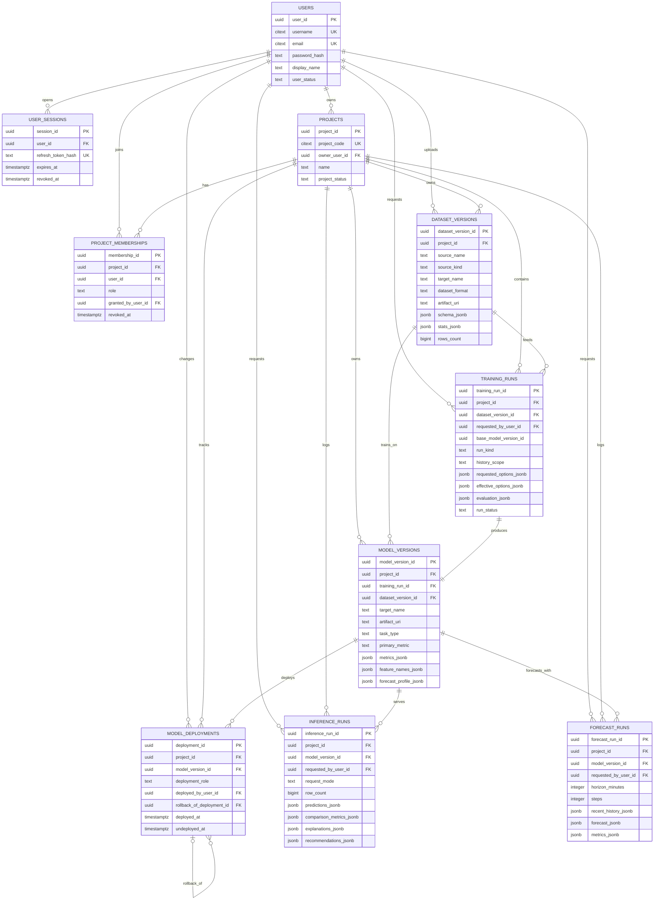

# Общая ER-диаграмма

На этой странице собрана одна общая Mermaid ER-диаграмма для компактной PostgreSQL-схемы проекта.

Она соответствует:

- `storage/postgresql/schema.sql`
- `alembic/versions/20260321_0001_compact_core_schema.py`

## Как читать диаграмму

- `training_runs` хранит и первичное обучение, и контролируемое переобучение.
- `model_deployments` фиксирует историю назначений `champion` и `serving`, поэтому откат выражается отдельной записью.
- Детальные результаты предсказаний, объяснений и рекомендаций хранятся внутри `JSONB`, чтобы схема оставалась компактной.
- Для подробных пояснений по каждой группе таблиц используйте страницу `Схема БД`.
