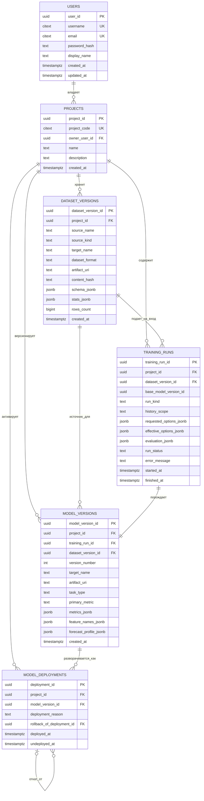

# Общая ER-диаграмма

На этой странице собрана одна общая Mermaid ER-диаграмма для упрощенной PostgreSQL-схемы проекта.

Она соответствует:

- `storage/postgresql/schema.sql`
- всем миграциям Alembic до `head`

## Как читать диаграмму

- `dataset_versions` хранит версии входных данных проекта.
- `training_runs` фиксирует как первичное обучение, так и контролируемое переобучение на новых данных.
- `model_versions` хранит полную историю обученных моделей внутри проекта.
- `version_number` позволяет пользователю выбирать конкретную версию модели для отката.
- `model_deployments` хранит историю активации модели, поэтому откат выражается новой записью, а не перезаписью старой.
