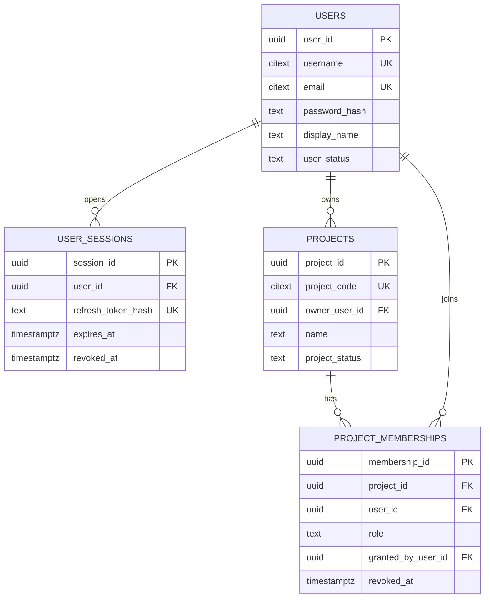
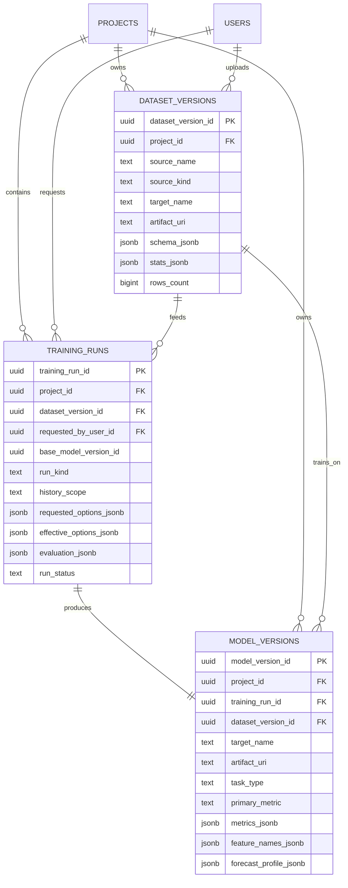
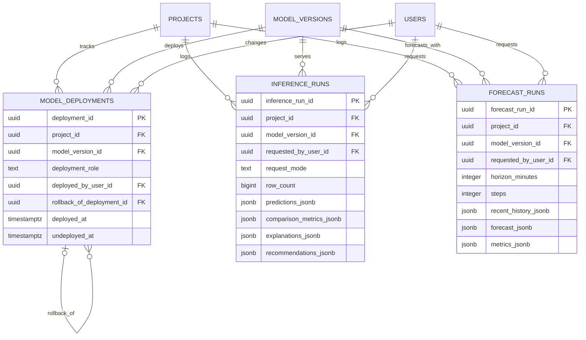

# Схема базы данных

На этой странице описана компактная PostgreSQL-схема проекта из `storage/postgresql/schema.sql`.

Та же структура оформлена как initial migration Alembic:

- `alembic/versions/20260321_0001_compact_core_schema.py`

Подход к схеме намеренно гибридный:

- ключевые сущности жизненного цикла остаются реляционными;
- изменчивые структуры вынесены в `JSONB`;
- тяжелые файлы и bundle моделей хранятся вне PostgreSQL и в БД представлены ссылками.

В итоге вместо полной сильно нормализованной схемы используется компактное ядро из 10 таблиц:

1. `users`
2. `user_sessions`
3. `projects`
4. `project_memberships`
5. `dataset_versions`
6. `training_runs`
7. `model_versions`
8. `model_deployments`
9. `inference_runs`
10. `forecast_runs`

## Принципы проектирования

- Реляционные таблицы используются для владения, истории, связей и отката.
- `JSONB` используется там, где структура естественно меняется от запуска к запуску.
- История деплоя хранится отдельными записями, а не флагами внутри модели.
- Исходные датасеты, выгрузки, отчеты и serialized models лучше держать в файловом хранилище или object storage.

## Где используется `JSONB`

Основные поля с `JSONB`:

- `dataset_versions.schema_jsonb`
- `dataset_versions.stats_jsonb`
- `training_runs.requested_options_jsonb`
- `training_runs.effective_options_jsonb`
- `training_runs.evaluation_jsonb`
- `model_versions.metrics_jsonb`
- `model_versions.feature_names_jsonb`
- `model_versions.forecast_profile_jsonb`
- `inference_runs.predictions_jsonb`
- `inference_runs.comparison_metrics_jsonb`
- `inference_runs.explanations_jsonb`
- `inference_runs.recommendations_jsonb`
- `forecast_runs.recent_history_jsonb`
- `forecast_runs.forecast_jsonb`
- `forecast_runs.metrics_jsonb`

## Доступ и владение



## Реестр датасетов и обучение



## Деплой, откат и аудит



## Практические замечания

- `projects` и `project_memberships` закрывают и владение проектом, и совместную работу без отдельного справочника ролей.
- `dataset_versions` заменяет источник, snapshot и таблицы с колонками одной записью датасета плюс `schema_jsonb` и `stats_jsonb`.
- `training_runs` хранит настройки запуска, режим переобучения, окно истории и результат сравнения с предыдущей моделью.
- `model_versions` содержит по одной записи на обученную модель, а метрики и профиль прогноза хранит в `JSONB`.
- `model_deployments` является источником истины для текущей `champion`-модели и текущей `serving`-модели.
- Откат оформляется как новая запись деплоя, указывающая на старую `model_version`.
- `inference_runs` и `forecast_runs` дают аудит без разрастания схемы в десятки таблиц построчных результатов.

## Почему схема стала меньше

В полной нормализованной версии пришлось бы выделять отдельные таблицы для:

- email-адресов
- внешних идентификаторов
- каталогов ролей
- источников датасетов
- snapshot-версий датасетов
- колонок датасета
- каталогов target
- каталогов алгоритмов
- каталогов метрик
- slot-таблиц для deploy
- prediction rows
- explanation rows
- decision rows
- точки прогноза

Текущий вариант оставляет реляционными только те части, которые реально важно фильтровать и связывать запросами, а остальное переносит в `JSONB`. Для текущей стадии проекта это более практичный баланс.

## Миграции и запуск

Локальный запуск PostgreSQL:

```bash
docker compose up -d postgres
```

Применение миграций:

```bash
python -m alembic upgrade head
```

Если нужен единый вид всех сущностей, откройте страницу `Общая ER-диаграмма` в навигации документации.
