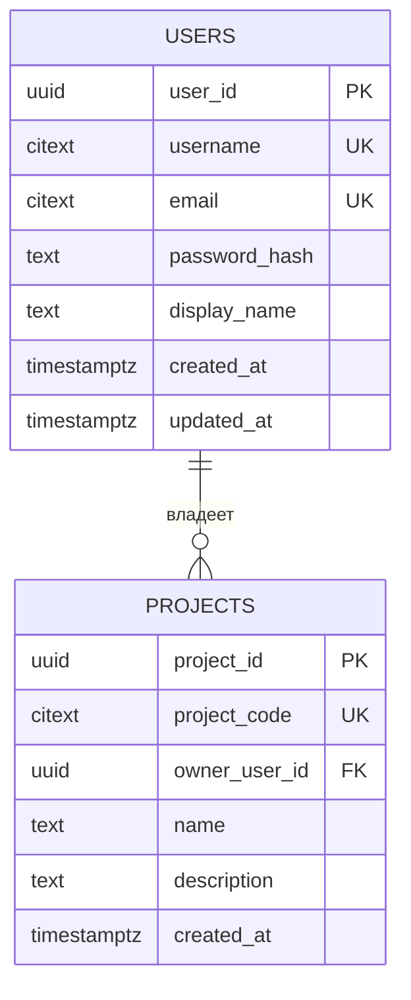
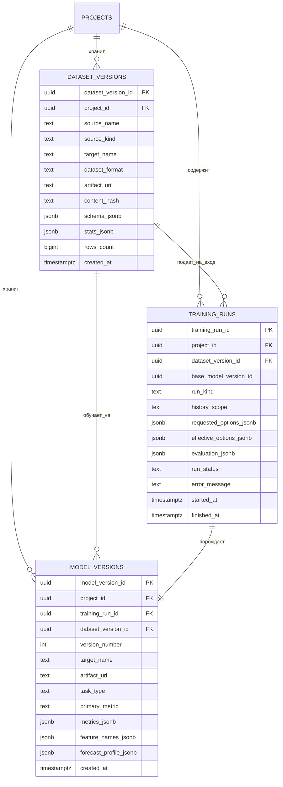
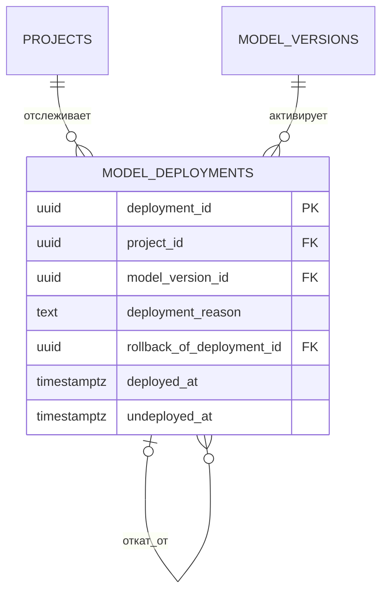

# Схема базы данных

На этой странице описана упрощенная PostgreSQL-схема проекта из `storage/postgresql/schema.sql`.

Текущее состояние схемы формируется миграциями Alembic:

- `alembic/versions/20260321_0001_compact_core_schema.py`
- `alembic/versions/20260322_0002_simplify_mvp_schema.py`

Схема сознательно упрощена под MVP:

- убраны поля жизненного цикла пользователей и проектов;
- убраны пользовательские сессии;
- убрана таблица участников проекта;
- убран слой аудита для предсказаний и прогноза;
- сохранены версии датасетов, версии моделей и история активации модели.

В итоге ядро состоит из 6 таблиц:

1. `users`
2. `projects`
3. `dataset_versions`
4. `training_runs`
5. `model_versions`
6. `model_deployments`

## Принципы проектирования

- Реляционные таблицы оставлены только там, где действительно важны связи, фильтрация и откат.
- `JSONB` используется для метаданных датасета, настроек обучения, метрик и профиля прогноза.
- Версионность моделей выражена явно через `model_versions.version_number`.
- Активная модель проекта хранится через историю `model_deployments`, а не флагом внутри модели.
- Тяжелые файлы и артефакты моделей остаются вне PostgreSQL и в БД представлены ссылками.

## Где используется `JSONB`

Основные поля с `JSONB`:

- `dataset_versions.schema_jsonb`
- `dataset_versions.stats_jsonb`
- `training_runs.requested_options_jsonb`
- `training_runs.effective_options_jsonb`
- `training_runs.evaluation_jsonb`
- `model_versions.metrics_jsonb`
- `model_versions.feature_names_jsonb`
- `model_versions.forecast_profile_jsonb`

## Пользователи и проекты



## Датасеты, обучение и версии моделей



## Активация модели и откат



## Практические замечания

- `projects.owner_user_id` достаточно для MVP, если каждый проект принадлежит одному пользователю.
- `dataset_versions` хранит версии загруженных и сгенерированных датасетов без отдельного каталога колонок.
- `training_runs` фиксирует режим `initial` или `retrain`, выбранное окно истории и результат сравнения со старой моделью.
- `model_versions` сохраняет полноценную историю обученных моделей, а `version_number` делает эту историю человекочитаемой.
- `model_deployments` является источником истины для текущей активной модели проекта.
- Откат оформляется как новая запись в `model_deployments`, указывающая на более раннюю версию модели.

## Почему схема стала меньше

Из MVP убраны сущности, которые усложняли схему без прямой пользы на текущем этапе:

- `user_sessions`
- `project_memberships`
- `inference_runs`
- `forecast_runs`
- поля жизненного цикла `user_status`, `project_status`, `archived_at`
- вторичные ссылки на пользователя в версиях датасетов, запусках обучения и деплое

Если эти сценарии понадобятся позже, их можно вернуть отдельными миграциями, не ломая ядро реестра.

## Миграции и запуск

Локальный запуск PostgreSQL:

```bash
docker compose up -d postgres
```

Применение миграций:

```bash
python -m alembic upgrade head
```

Если база уже была создана по старой версии схемы, новая миграция упростит ее до текущего MVP-состояния.

Если нужен единый вид всех сущностей, откройте страницу `Общая ER-диаграмма` в навигации документации.
